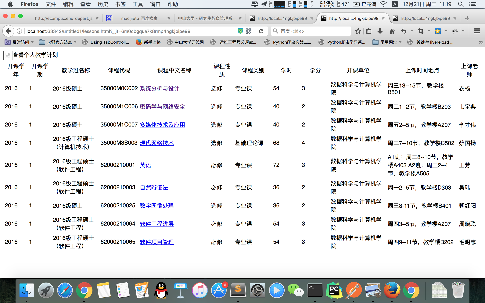
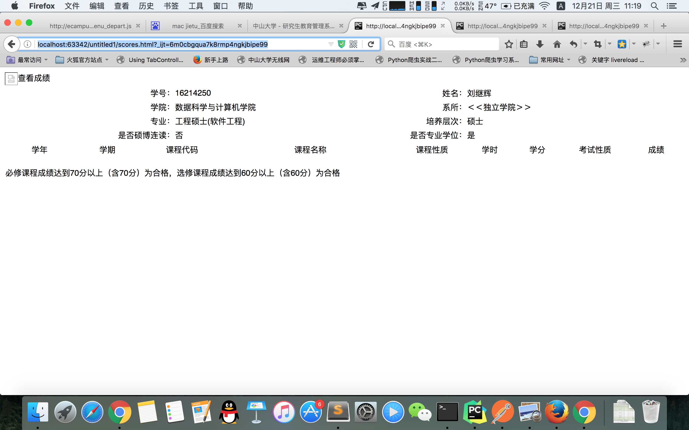

#中山大学研究生教务系统爬虫

##简要介绍

利用request进行交互，采用request进行交互，创建同一个session保持会话，避免了本地保存cookie文件的读写。因为教务系统改版比较少，所以直接登陆后提取成绩，学生信息，课程三个地址的内容，而不是从main.jsp中直接爬取。

## beautiful soup

用于进行html内容解析的python库

##PhantomJs和Selenium

sysuV2.py使用PhantomJS来模拟浏览器的js渲染，使用Selenium模拟交互,需要加入chrome作为驱动，傻瓜式的操作。

##抓取效果

